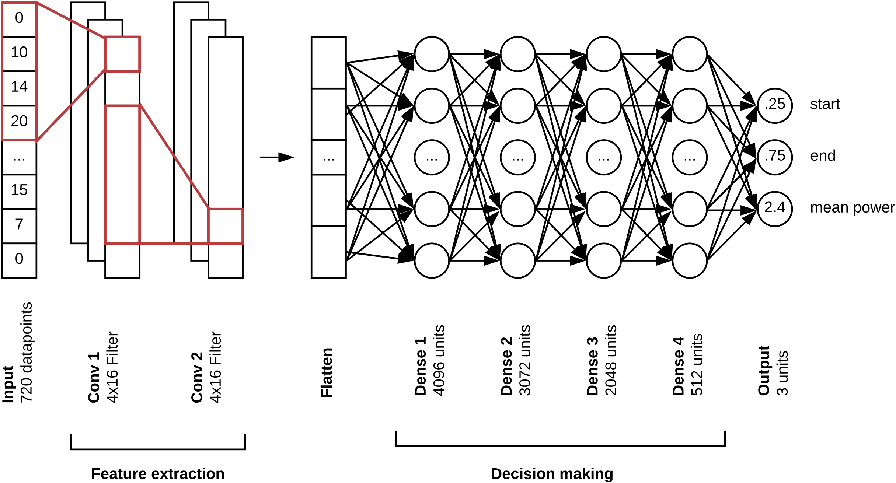
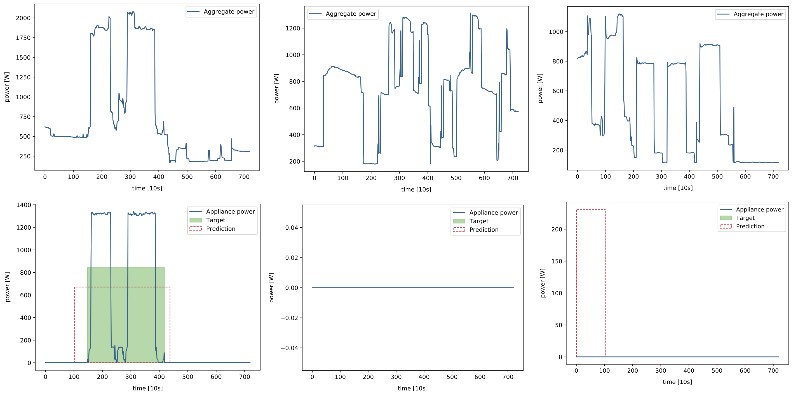
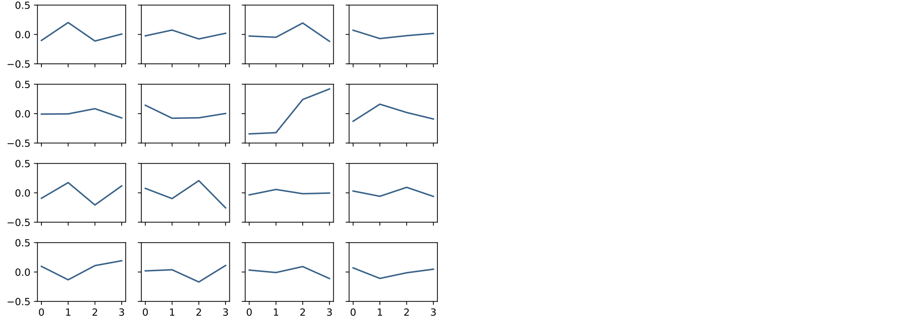
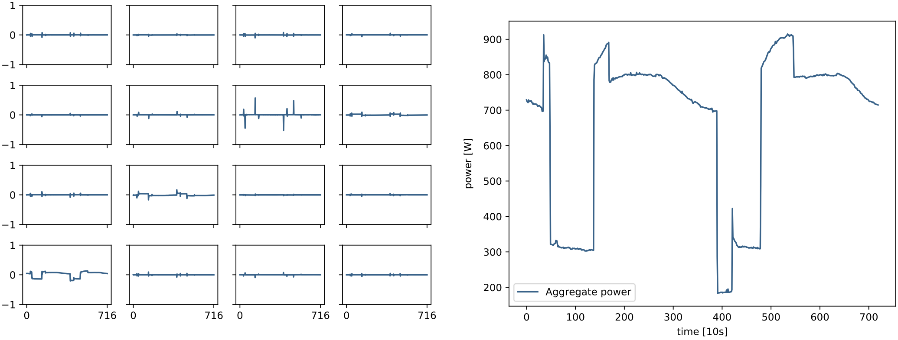
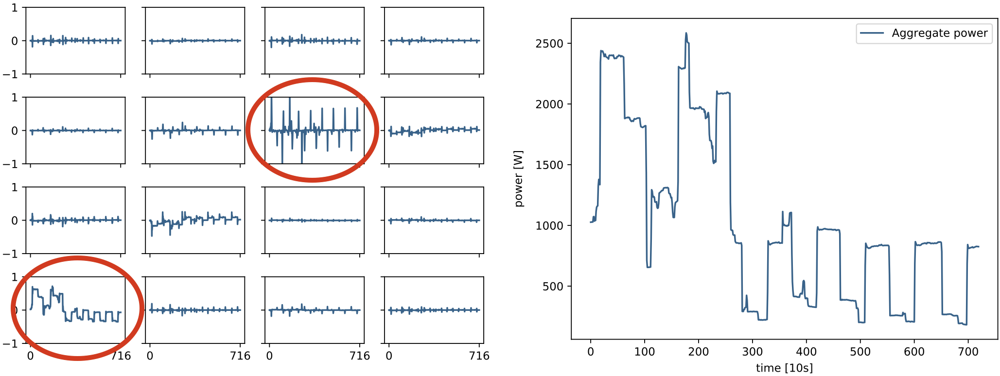

# NNILM - Neural Non-Intrusive Load Monitoring

This project is a reimplementation of [Jack Kelly's](https://github.com/JackKelly) rectangles architecture based on [Keras](https://keras.io/) and the [NILMToolkit](https://github.com/nilmtk/nilmtk). 

## Network overview

## Benchmark comparison

A comparison of the rectangles architecture in this repository with the original implementation by Jack Kelly on the UK-DALE dataset.

## Predictions

Predictions for a true positive, a true negative and a false positive example for a dish washer.

## Visualization of first convolution layer

### Learned filters

The following image shows the 16 learned filters of the first convolution layer.

### Activations for a negative sample

The following image shows the activations of the first convolution layer given a negative sample.

### Activations for a positive sample

The following image shows the activations of the first convolution layer given a positive sample.
The two highlighted filters are thereby interesting. 
The first filter seems to have learned to detect step changes in the input signal.
The second filter seems to have learned to pass the raw input signal to the next layer.

## Development

### Setup virtualenv

We used Python 2 as programming language, because there are some dependencies that are not compatible with Python 3.

- `pip install virtualenv`

- `python -m virtualenv env`

- `source env/bin/activate`

If you set up virtualenv with Python 3, you have to switch to Python 2: `virtualenv --python=/usr/bin/python2.7 env`

### Install dependencies

Because of a failing dependency `hmmlearn`, we use the option `--no-dependencies`. The module `hmmlearn` is
not really needed in this implementation.

- `pip install --no-dependencies -r requirements.txt`
- `pip install -e .`

### Leave virtualenv

- `deactivate`

## Dataset

It is possible to use any dataset supported by the NILMToolkit. 
You have to convert the dataset to a .h5 file using the converters provided by the NILMToolkit and then place it into the folder `./data`:
https://github.com/nilmtk/nilmtk/tree/master/nilmtk/dataset_converters 
 
## Run training

Run training for 30 epochs: `python nnilm/train.py dish_washer_redd -s0 -e30`

Resume training from epoch 30: `python nnilm/train.py dish_washer_redd -s30 -e40`

Run training on GPU cluster: `nohup python nnilm/experiments/train_hpc.py --gpu=2 &`
 
## Run prediction

Public dataset: `python predict.py dish_washer_eco`

CSV prediction: `python nnilm/experiments/csv_predictor.py -ddish_washer_redd -idata/aggregated_power.csv -s01-04-2018 -e08-04-2018`

## Experiments

The folder `nnilm/experiments` contains files that have been used to run my experiments. 
It shows how the scripts from this repository can be used in another project.